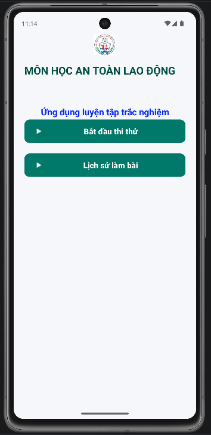
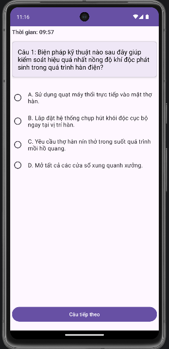
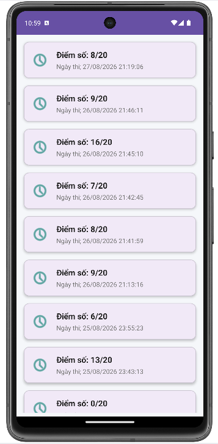

# 📱 AppThiThuATLD - Ứng dụng Thi Thử An Toàn Lao Động

**AppThiThuATLD** là ứng dụng Android hỗ trợ thi thử trắc nghiệm môn học **An toàn lao động**. Dự án được xây dựng dựa trên kiến trúc ứng dụng di động hiện đại, xử lý dữ liệu local an toàn và tối ưu hóa trải nghiệm người dùng bằng các tác vụ đa luồng.

---

## 🚀 Tính năng chính

* **Thi thử (Exam):** Tạo đề thi ngẫu nhiên (20 câu hỏi) kèm đồng hồ đếm ngược (10:00). Tự động nộp bài và khóa khi hết giờ.
* **Lịch sử làm bài:** Lưu trữ kết quả thi (điểm số, tổng số câu, ngày giờ làm bài) để người dùng dễ dàng theo dõi tiến độ.

---

## 🛠️ Công nghệ & Phần mềm sử dụng

* **Môi trường:** Android Studio Quail2 | AVD Pixel 7 (Android 13.0 - API 33).
* **Ngôn ngữ:** Java (JDK 21) | XML.
* **Cơ sở dữ liệu:** SQLite | Room Persistence Library.
* **UI/UX:** Google Material Design Components.
* **Đa luồng:** Java Concurrency (ExecutorService / ThreadPool).

---

## 📊 Kiến trúc Dữ liệu (SQLite)

Hệ thống quản lý cơ sở dữ liệu local thông qua **Room Database** gồm 3 bảng chính:

### 1. Bảng `Categories` (Chủ đề học tập)
* `id` (INTEGER, PK, AutoIncrement): Mã chủ đề.
* `name` (TEXT): Tên chủ đề (Ví dụ: "An toàn điện").
* `description` (TEXT): Mô tả ngắn gọn.

### 2. Bảng `Questions` (Ngân hàng câu hỏi)
* `id` (INTEGER, PK, AutoIncrement): Mã câu hỏi.
* `category_id` (INTEGER, FK): Liên kết với bảng `Categories`.
* `question_text` (TEXT): Nội dung câu hỏi.
* `option_a` / `b` / `c` / `d` (TEXT): Các phương án lựa chọn.
* `correct_option` (INTEGER): Đáp án đúng (1: A, 2: B, 3: C, 4: D).
* `explanation` (TEXT): Giải thích đáp án.
* `is_bookmarked` (INTEGER): Trạng thái lưu câu hỏi (0 hoặc 1).

### 3. Bảng `Exam_History` (Lịch sử thi thử)
* `id` (INTEGER, PK, AutoIncrement): Mã lượt thi.
* `score` (INTEGER): Số câu trả lời đúng.
* `total_questions` (INTEGER): Tổng số câu trong đề thi.
* `date_taken` (TEXT): Ngày giờ thi (`YYYY-MM-DD HH:MM:SS`).

---

## 📁 Cấu trúc thư mục mã nguồn

```text
app/src/main/
├── java/com/yourpackage/appthithuatld/
│   ├── MainActivity.java             # Điều khiển màn hình chính (Menu)
│   ├── model/
│   │   ├── Question.java             # Thực thể bảng Câu hỏi
│   │   └── ExamHistory.java          # Thực thể bảng Lịch sử thi
│   ├── database/
│   │   ├── QuizDatabase.java         # Cổng kết nối cơ sở dữ liệu Room trung tâm
│   │   ├── QuestionDao.java          # Giao tiếp truy vấn bảng Câu hỏi
│   │   ├── ExamHistoryDao.java       # Giao tiếp truy vấn bảng Lịch sử
│   │   └── DataRepository.java       # Chứa và nạp dữ liệu câu hỏi thực tế
│   ├── activity/
│   │   ├── QuizActivity.java         # Xử lý logic màn hình làm bài thi
│   │   └── HistoryActivity.java      # Xử lý logic màn hình xem lịch sử
│   └── adapter/
│       └── ExamHistoryAdapter.java   # Quản lý và ánh xạ dữ liệu vào RecyclerView
└── res/layout/
    ├── activity_main.xml             # Giao diện trang chủ
    ├── activity_quiz.xml              # Giao diện màn hình thi thử
    ├── activity_history.xml           # Giao diện màn hình lịch sử (RecyclerView)
    └── item_exam_history.xml         # Thiết kế hiển thị cho từng dòng kết quả
```

---

## ⚙️ Cơ chế xử lý kỹ thuật nổi bật

### 1. Nạp dữ liệu tự động (Seed Data)
Sử dụng `roomCallback` trong `QuizDatabase.java` kết hợp với `DataRepository.java`. Hệ thống tự động kích hoạt luồng phụ để nạp toàn bộ ngân hàng câu hỏi vào SQLite trong lần đầu tiên ứng dụng khởi chạy.

### 2. Xử lý bất đồng bộ an toàn (Asynchronous Processing)
Mọi thao tác đọc/ghi vào cơ sở dữ liệu SQLite đều được đẩy vào luồng phụ ngầm thông qua `databaseWriteExecutor` nhằm giải phóng **UI Thread (Main Thread)**, ngăn chặn hoàn toàn tình trạng đơ nghẽn màn hình. Dữ liệu sau khi tải xong được trả về giao diện thông qua phương thức `runOnUiThread`.

### 3. Tối ưu vòng đời cập nhật (Lifecycle Optimization)
Tại `HistoryActivity.java`, logic tải danh sách dữ liệu lịch sử thi được đặt trong hàm `onResume()` thay vì `onCreate()`. Điều này đảm bảo mỗi khi người dùng hoàn thành bài thi và quay lại màn hình lịch sử, danh sách kết quả luôn tự động làm mới.

---

## 📸 Hình ảnh minh họa sản phẩm
| Giao diện chính | Chức năng Thi thử | Lịch sử làm bài |
| :---: | :---: | :---: |
|  |  |  |
 

